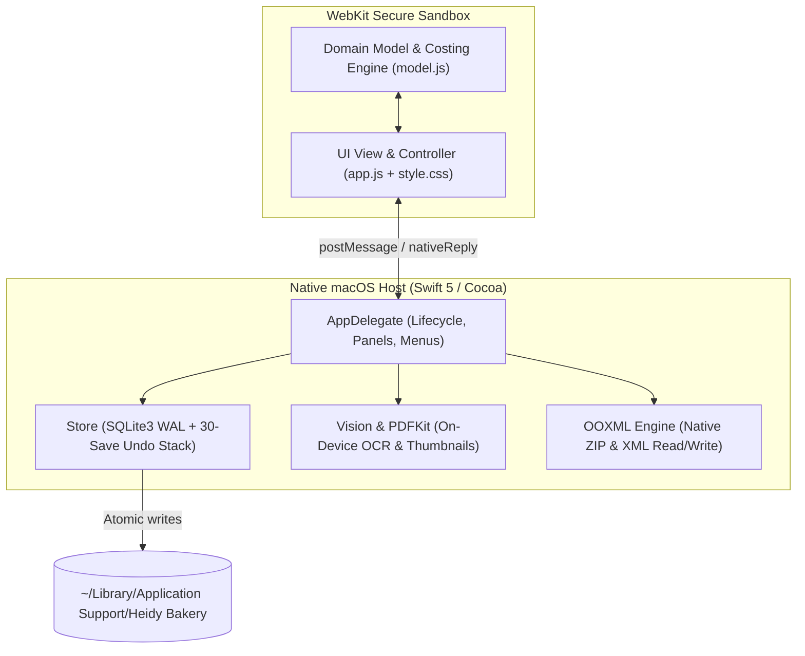

# Heidy's Bakery — System Architecture

This document details the architectural design, security model, data flow, and calculation engine of **Heidy's Bakery**, a native, fully offline macOS costing and pricing application.

---

## 1. High-Level Architecture

The application is structured as a native macOS Cocoa host wrapping an isolated WebKit interface. It contains **no remote servers, cloud databases, external API dependencies, telemetry, or third-party web dependencies**.



---

## 2. Component Breakdown

### 2.1 Native Swift Host (`Source/Main.swift`)

The host application is written in pure Swift using system frameworks (`Cocoa`, `WebKit`, `Vision`, `PDFKit`, `CryptoKit`, `SQLite3`, `UniformTypeIdentifiers`).

- **Window Management**: Fixed minimum dimensions ($760 \times 560$), default launch size ($1200 \times 840$), standard Mac Edit menu bindings (Undo $\text{Cmd+Z}$, Cut/Copy/Paste/Select All).
- **Security & Sandboxing**:
  - WebKit navigation policy restricts loading strictly to local bundle file URLs (`index.html`).
  - Content Security Policy (CSP) in `index.html` blocks external network connections:
    ```html
    default-src 'self'; img-src 'self' data:; style-src 'self'; script-src 'self'; connect-src 'none'; object-src 'none'
    ```
  - Filename sanitization via `AppDelegate.safeName()` strictly prohibits directory traversal (`..`, `/`, `\`).

### 2.2 Bidirectional JavaScript Bridge

The interface communicates with the native host through asynchronous message passing:

1. **JavaScript to Native**:
   ```javascript
   window.webkit.messageHandlers.native.postMessage({ id: "1", action: "save", payload: state });
   ```
2. **Native to JavaScript**:
   ```swift
   web.evaluateJavaScript("window.nativeReply({\"id\":\"1\",\"result\":true,\"error\":null})", completionHandler: nil)
   ```

Supported native actions:
- `load`: Reads persisted state from SQLite or bundle seed (`seed.json`).
- `save`: Atomically commits state to SQLite with transaction safety.
- `undo`: Rolls back the active state to the immediate previous snapshot.
- `chooseInbox`: Opens system `NSOpenPanel` for selecting receipt folder.
- `importReceipts` / `scanInbox`: Ingests receipt photos/PDFs with SHA-256 deduplication.
- `previewReceipt`: Renders base64 PNG thumbnail using `PDFKit` or `NSImage`.
- `openReceipt`: Launches the original image or PDF in macOS default viewer (Preview).
- `exportExcel`: Creates a standard multi-sheet `.xlsx` file using native ZIP/XML.
- `importExcel`: Reads, validates, and previews input columns from an exported `.xlsx`.
- `backup`: Archives entire state plus original receipt files into a single `.heidybackup` archive.
- `readBackup` / `restoreBackup`: Validates and restores complete database and receipts.
- `showDataFolder`: Opens `~/Library/Application Support/Heidy Bakery` in Finder.

---

## 3. Data Persistence & Durability Engine

The application avoids ORM complexity and schema migration overhead by utilizing a **versioned JSON document store over ACID SQLite**:

```sql
PRAGMA journal_mode = WAL;
PRAGMA synchronous = FULL;

CREATE TABLE IF NOT EXISTS state (
    id INTEGER PRIMARY KEY CHECK(id=1),
    json TEXT NOT NULL
);

CREATE TABLE IF NOT EXISTS history (
    id INTEGER PRIMARY KEY AUTOINCREMENT,
    json TEXT NOT NULL,
    created TEXT DEFAULT CURRENT_TIMESTAMP
);
```

### Durability Guarantees
- **WAL Mode (`Write-Ahead Logging`)**: Concurrent non-blocking reads and high-speed atomic writes.
- **`PRAGMA synchronous = FULL`**: Synchronizes WAL frames to physical storage before commit completion, preventing corruption during system power loss.
- **Transactional Atomicity**: All state updates occur in `BEGIN IMMEDIATE ... COMMIT` blocks. If any error occurs, automatic `ROLLBACK` prevents partial writes.
- **30-Step Undo History**: On every save, the preceding state is copied into `history`. When undo is requested, the previous snapshot is restored and popped from `history`.
- **Receipts Storage**: Original receipt files are saved directly into the local `Receipts/` directory under their SHA-256 hex digest (`<sha256>.<ext>`). They are immutable and never deleted by undo actions.

---

## 4. Domain Model & Costing Mathematics (`Resources/model.js`)

All pricing arithmetic, unit conversions, and validation logic reside in `model.js`. This model is decoupled from DOM manipulation and is fully tested via Node.js (`Tests/model.test.cjs`).

### 4.1 Unit Conversion Graph
Units are partitioned into three isolated dimensions: **mass**, **volume**, and **count**.

| Dimension | Supported Units | Normalized Base Ratio |
|---|---|---|
| **Mass** | `g` (base), `kg`, `oz`, `lb` | $1\,\text{g} = 1.0$, $1\,\text{kg} = 1000.0$, $1\,\text{oz} = 28.349523125\,\text{g}$, $1\,\text{lb} = 453.59237\,\text{g}$ |
| **Volume** | `ml` (base), `l`, `tsp`, `tbsp`, `fl oz`, `cup` | $1\,\text{ml} = 1.0$, $1\,\text{l} = 1000.0$, $1\,\text{tsp} = 4.92892159375\,\text{ml}$, $1\,\text{tbsp} = 14.78676478125\,\text{ml}$, $1\,\text{fl oz} = 29.5735295625\,\text{ml}$, $1\,\text{cup} = 236.5882365\,\text{ml}$ |
| **Count** | `each` (base), `piece`, `dozen` | $1\,\text{each} = 1.0$, $1\,\text{piece} = 1.0$, $1\,\text{dozen} = 12.0$ |

> [!CAUTION]
> **No Guessing**: The engine strictly refuses to convert across different dimensions (e.g. `g` to `ml` or `cup` to `oz`). Such conversions require ingredient-specific bulk density and must be entered explicitly.

### 4.2 Unit Cost Arithmetic

1. **Ingredient Unit Cost**:
   $$\text{Cost}_{\text{item}} = \frac{\text{Package Price}}{\text{Package Size}}$$
2. **Recipe Line Cost**:
   $$\text{Quantity}_{\text{effective}} = \text{Line Quantity} \times \begin{cases} \text{Recipe Yield} & \text{if per piece} \\ 1 & \text{if per batch} \end{cases}$$
   $$\text{Line Cost} = \text{Quantity}_{\text{effective}} \times \text{Conversion Factor} \times \text{Cost}_{\text{item}}$$
3. **Total Batch Cost**:
   $$\text{Batch Cost} = \sum \text{Ingredients} + \sum \text{Packaging} + (\text{Labour Hours} \times \text{Labour Rate}) + \text{Other Batch Costs}$$
4. **Cost Per Unit (Cost Per Piece)**:
   $$\text{Unit Cost} = \frac{\text{Batch Cost}}{\text{Recipe Yield}}$$
5. **Bulk Cost Overrides**:
   $$\text{Bulk Unit Cost} = \frac{\sum \text{Ingredients} + \text{Packaging}_{\text{bulk}} + \text{Labour}_{\text{bulk}} + \text{Other Costs}}{\text{Recipe Yield}}$$
   where:
   - $\text{Packaging}_{\text{bulk}} = \text{bulkPackaging} \times \text{Yield}$ (if specified) else $\sum \text{Packaging}$
   - $\text{Labour}_{\text{bulk}} = \text{bulkLabourHours} \times \text{Labour Rate}$ (if specified) else $(\text{Labour Hours} \times \text{Labour Rate})$
6. **Suggested Selling Prices**:
   $$\text{Retail Suggested} = \text{Unit Cost} \times \left(1 + \frac{\text{Retail Markup \%}}{100}\right)$$
   $$\text{Bulk Suggested} = \text{Bulk Unit Cost} \times \left(1 + \frac{\text{Bulk Markup \%}}{100}\right)$$
7. **Gross Margin Calculation**:
   $$\text{Margin \%} = \frac{\text{Selling Price} - \text{Unit Cost}}{\text{Selling Price}} \times 100$$

### 4.3 Selling Price Stability Guarantee
Manual selling prices entered by the user **never change automatically** when receipt prices rise. Instead:
- When an ingredient cost increases, a review alert is flagged if the increase exceeds `settings.alertPercent`.
- A `costBaseline` is recorded. When the user acknowledges the change via **Mark cost change as reviewed**, the alert clears while preserving the user's manual retail and bulk selling prices.

---

## 5. Receipt Ingestion & On-Device OCR

Receipt processing occurs completely locally on the Mac:

1. **Deduplication**: Ingested files are hashed using SHA-256 (`CryptoKit`). If a file with an identical hash exists, it is marked as a duplicate and redundant processing is skipped.
2. **Apple Vision OCR**:
   - Executes `VNRecognizeTextRequest` on background threads with `.accurate` recognition level and language correction enabled.
   - Text lines are extracted and assembled in reading order.
3. **PDFKit Handling**:
   - For PDFs, page count is inspected. Text from the first 10 pages is extracted directly via `PDFPage.string`.
   - If embedded text is absent (scanned PDF), high-resolution page thumbnails are rendered to `CGImage` and passed through Vision OCR.
4. **Candidate Line Parsing**:
   - Regex-based heuristics extract lines matching `[Description] [Price]`.
   - Excludes non-ingredient lines (e.g. `Tax`, `Subtotal`, `Visa`, `Savings`, `Total`, `Change`).
   - Reuses stored exact matches from `state.mappings["supplier|description"]` to auto-populate ingredient ID, package size, and unit.

---

## 6. Dependency-Free OOXML (Excel) Engine

The application contains an internal OpenXML engine implemented in Swift without external libraries:

- **Generation (`writeWorkbook`)**: Creates valid OOXML `.xlsx` ZIP archives containing `[Content_Types].xml`, `_rels/.rels`, `xl/workbook.xml`, `xl/styles.xml`, and individual worksheet XML files.
- **Formulas & Number Formatting**: Emits live Excel formulas (`SUMIF`, `IF`, `COUNT`, `OR`, `*`, `/`) alongside custom style formatting for currency (`"$#,##0.00"`), percentages (`"0.0%"`), and high-precision unit costs (`"$0.00000"`).
- **Import Parser (`readWorkbook` / `WorkbookXML`)**: SAX-based streaming XML parser using Apple's `XMLParser`. Resolves `sharedStrings.xml` table and reconstructs 2D row arrays.
- **Safety Enforcement**:
  - Excel files larger than 20 MB are rejected.
  - Reimport strictly validates headers and record IDs.
  - Formula cells in editable input sheets are blocked on import to prevent formula injection or calculation mismatches.
