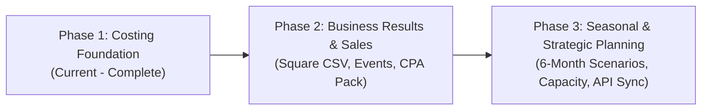

# Heidy's Bakery — Feasibility Analysis & Strategic Roadmap

*Document based on the September 6, 2026 feasibility evaluation prepared for Heidy and Arvind.*

---

## 1. Executive Summary & Strategy

The Heidy Bakery software project is divided into three distinct phases. 

The primary objective is to **keep the first release useful, robust, and sovereign on its own**, while establishing clean data schemas so that future sales reporting, tax extracts, and seasonal planning do not require rewriting the underlying foundation.

---

## 2. Three-Phase Delivery Plan

### Phase 1: Costing Foundation *(Status: Built & Validated)*
- **Offline Mac application** (Cocoa + WebKit + SQLite WAL).
- **Corrected recipe costing engine** with full ingredient/packaging summation, unit conversions, and yield arithmetic.
- **Retail & Bulk pricing lists** with live margin calculations and alert baselines.
- **On-device receipt OCR** using Apple Vision and PDFKit, with duplicate suppression and supplier learning.
- **Excel independence**: Dependency-free export to OOXML `.xlsx` with live formulas and verified reimport.
- **Full backup & restore** bundling SQLite document state with original high-resolution receipt files.

---

### Phase 2: Business Results & Channel Profitability *(Next Phase)*

Phase 2 transitions the app from a recipe costing tool to a complete **business management and CPA-ready system**.

#### 2.1 Square POS Integration (File-Based First)
- **CSV Report Importer**: Square officially supports CSV transaction and item detail exports. Ingesting these files avoids the security and token maintenance overhead of live cloud API credentials.
- **Product-to-Recipe Mapping**:
  - Map Square Item IDs and Variation IDs to Recipe IDs.
  - Multi-pack normalization: A "Box of 6 Pastries" must map to 6 recipe units, not 1.
  - Handling Custom Amount sales: Provide an interface to classify custom amounts into specific product categories.
  - Overlapping date protection: Repeating an import for overlapping date ranges must skip previously ingested transactions without duplicating revenue.
  - Fee & Refund tracking: Deduct Square processing fees and track returns separately from net sales.

#### 2.2 Channel & Event Tracking
The business operates across distinct channels with vastly different cost structures:

1. **Saturday Farmers Markets**:
   - Reusable Saturday closeout template: Date, location, total imported Square sales, cash received.
   - Production closeout: Batches baked, unsold leftovers, samples, and waste.
   - Event expenses: Stall fee, market registration, parking, fuel/travel, and paid helper wages.
2. **Weddings & Custom Celebrations**:
   - Order tracking: Customer details, event date, quoted price, custom decoration costs, delivery fees.
   - Milestone payments: Track deposits vs. final balance payments.
   - Milestone reconciliation: A wedding deposit paid via Square must link to the wedding order rather than creating duplicate sales revenue.
3. **B2B Wholesale Accounts (e.g. Bookstores, Cafes)**:
   - Account ledger: Customer, delivery date, units delivered, invoice price, payment due date.
   - Terms definition: Explicitly distinguish between **outright wholesale** and **consignment** (delivery on consignment is not a completed sale until sold).

#### 2.3 Operating Expenses & CPA Working Pack
- **Operating Expense Ledger**: Track kitchen/commissary rent, commercial insurance, business licensing, marketing/advertising, packaging supplies, and equipment maintenance.
- **IRS Schedule C & Tax Alignment**:
  - **Owner Time vs. Paid Staff**: Under IRS Schedule C, payments to sole proprietors are owner draws, not wage deductions. The app must present:
    1. *Operating result before owner compensation* (tax-aligned).
    2. *Management result after valuing Heidy's time* (economic reality).
    3. *Cash movement* (bank deposits and transfer timing).
  - **Purchases vs. Consumption**: Buying a 50 lb sack of flour is an inventory purchase; weekly profit calculations must use recipe consumption plus recorded spoilage rather than counting entire bulk purchases in a single week.
  - **Vehicle Travel**: Track trip dates, business destinations, and logged mileage. Do not mix standard mileage rate deductions with direct fuel receipts.
- **CPA Export Pack**:
  - Structured summary export for Heidy's accountant: monthly sales by channel, collected sales taxes, processing fees, verified business expenses, and linked receipt image index.

---

### Phase 3: Seasonal Planning & Strategic Convenience

Heidy's long-term business objective includes **earning a full year's target income while actively baking for only six months** (e.g. high-volume market and wedding seasons).

#### 3.1 Six-Month Seasonal Scenario Calculator
Recipe margins alone cannot predict annual income. Phase 3 implements an SBA-aligned break-even and scenario model:

- **Scenario Controls**:
  - Choose active trading months (accounting for market closures, holidays, weather cancellations).
  - Set expected volume by channel (markets, wholesale accounts, custom orders).
  - Define year-round fixed expenses: Kitchen rent, insurance, and loan payments that continue even during non-baking months.
  - Factor in production hours: Preparation, shopping, baking, decorating, transit, booth operation, and cleanup.
- **Decision Outputs**:
  - Net operating profit before personal taxes across Conservative, Expected, and Optimistic scenarios.
  - Average profit earned per owner hour worked.
  - Break-even order volume required to cover annual overhead.
  - Tradeoff analysis: Evaluating whether booking 3 higher-value wedding cakes justifies skipping 2 low-margin Saturday markets.

#### 3.2 Optional Direct Square API Sync
- Direct read-only integration with the Square Orders API and Payouts API.
- Automated daily sync when opening the Mac app, retaining local-first architecture without hosting an intermediate server.

---

## 3. Core Accounting & Modeling Boundaries

To prevent misleading financial conclusions, the software maintains these strict accounting rules:

| Concept | What It Is In The App | What It Is NOT |
|---|---|---|
| **Recipe Labour** | An allowance added to batch cost to guide minimum pricing targets. | Not an IRS-deductible wage expense for a sole proprietor. |
| **Square Bank Payout** | A settlement transfer of funds to the checking account. | Not equal to net profit (contains tax collections, tips, and fees). |
| **Flour / Sugar Purchase** | A cash expenditure for raw material inventory. | Not immediate weekly cost-of-goods-sold until consumed. |
| **New Receipt Price** | Today's replacement cost used for forward-looking pricing suggestions. | Does not retroactively alter the recorded profit of past sales. |
