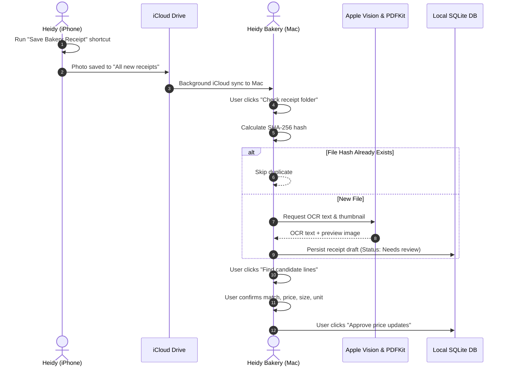

# Heidy's Bakery — Receipt Capture & Verification Pipeline

This document explains the end-to-end receipt pipeline: from photographing a paper receipt on an iPhone to on-device OCR, line matching, quantity validation, and price approval.

---

## 1. Pipeline Overview



---

## 2. iPhone Capture Setup

Receipt capture uses a native Apple Shortcut on Heidy's iPhone:
- **Shortcut Name**: `Save Bakery Receipt`
- **Destination Folder**: `iCloud Drive > Shortcuts > All new receipts`
- **File Format**: High-resolution camera capture (`.heic` or `.jpeg`).
- **Syncing**: Handled automatically by macOS and iOS iCloud Drive daemon. When the Mac is connected to Wi-Fi, receipts arrive within seconds.

---

## 3. Ingestion & Deduplication

When Heidy clicks **Check receipt folder** in the Receipts tab:
1. The app enumerates supported files in the configured folder:
   - Extensions: `.jpg`, `.jpeg`, `.png`, `.heic`, `.pdf`, `.tiff`
2. **File Size Limit**: Individual files must not exceed **40 MB**.
3. **Cryptographic SHA-256 Hashing**:
   - Each file's raw bytes are hashed using Apple's `CryptoKit.SHA256`.
   - If the hash already exists in `state.receipts`, the file is skipped as a duplicate.
4. **Permanent File Storage**:
   - New files are copied to the application's local directory:
     `~/Library/Application Support/Heidy Bakery/Receipts/<hash>.<ext>`
   - This ensures original files remain intact even if the iCloud folder is later cleared.

---

## 4. On-Device Text Recognition (OCR)

All text recognition runs **locally on Apple Silicon or Intel hardware** using Apple's system frameworks. No images or text are sent to cloud services or external AI APIs.

### 4.1 Image Recognition (Photos)
- Framework: `Vision` (`VNRecognizeTextRequest`).
- Recognition Level: `.accurate` (neural network model).
- Language Correction: Enabled (`usesLanguageCorrection = true`).
- Reading Order: Bounding boxes are organized top-to-bottom and lines are joined with standard line breaks.

### 4.2 PDF Recognition
- Framework: `PDFKit` (`PDFDocument`, `PDFPage`).
- Multi-page Support: Up to 10 pages are processed.
- Native Text Layer: The app first inspects `PDFPage.string`. If clear selectable text is found, it is used directly.
- Scanned Fallback: If no text layer exists (e.g. scanned multi-page paper invoice), the app renders high-resolution page thumbnails ($1800 \times 2400$) to `CGImage` and passes them to `Vision` OCR.

---

## 5. Candidate Line Extraction & Supplier Memory

When Heidy clicks **Find candidate lines**:

### 5.1 Extraction Heuristics
The app parses recognized lines against price patterns:
```regex
^(.+?)\s+\$?(-?\d+[.,]\d{2})\s*[A-Z]?$
```
Lines matching common non-ingredient markers are filtered out:
- `Total`, `Subtotal`, `Tax`, `Cash`, `Change`, `Balance`
- `Visa`, `MasterCard`, `Payment`, `Savings`, `Discount`, `Coupon`

### 5.2 Automatic Supplier Matching
The app maintains a learning mapping dictionary:
$$\text{state.mappings}[\text{normalized(supplier)} + \text{"|"} + \text{normalized(description)}] \longrightarrow \{\text{ingredientId}, \text{size}, \text{unit}\}$$

If Heidy previously matched an item description from that retailer (e.g. `"COSTCO|KS ORG EGGS 2DZ"` to `"Organic Eggs"`), the candidate extractor automatically pre-selects:
- The ingredient ID
- The package size
- The unit of measurement

---

## 6. Purchase Verification Rules

Before approving a receipt, the operator verifies each purchase line:

### 6.1 Package Size vs. Total Quantity Rules
> [!IMPORTANT]
> Always enter the **total quantity received** and the **total price paid for that quantity**.

- **Eggs**: If buying a flat of 60 eggs for \$14.99:
  - Quantity: `60`
  - Unit: `each`
  - Price: `14.99`
  *(Cost per egg calculated as $\$14.99 / 60 = \$0.24983$)*
- **Flour / Sugar**: If buying two 1 kg bags bundled for \$6.50:
  - Quantity: `2000`
  - Unit: `g`
  - Price: `6.50`
  *(Cost per gram calculated as $\$6.50 / 2000 = \$0.00325$)*
- **Bottled Extracts / Dairy**: If buying 500 ml vanilla extract for \$28.00:
  - Quantity: `500`
  - Unit: `ml`
  - Price: `28.00`

### 6.2 Exclusion of Non-Bakery Items
Personal groceries, cleaning supplies, and transaction fees can be excluded by checking:
- `Exclude personal item, refund or non-ingredient expense`
Excluded lines are kept on the receipt for financial reconciliation, but they do not alter ingredient master costs.

### 6.3 $0 / Free Item Confirmation
To prevent typos or partial OCR errors from making an ingredient appear free, any line with a price of `$0.00` requires explicit confirmation via:
- `I confirm this purchase was free (only for a $0 price)`

---

## 7. Approval & Audit Trail Integrity

When Heidy clicks **Approve price updates**:

1. **Receipt Date Validation**:
   - The purchase date must be valid and cannot be in the future.
2. **Current vs. Historical Update Protection**:
   - If the receipt date is **newer than or equal to** the ingredient's current `updated` date:
     The ingredient's active `price`, `size`, `unit`, `supplier`, and `updated` fields are replaced.
   - If the receipt date is **older** than the ingredient's current `updated` date:
     The purchase is appended to `ingredient.history`, but the ingredient's active master price remains unchanged. This prevents entering a backlog receipt from accidentally rolling back a newer price.
3. **Full History Audit Log**:
   Every approval logs an event to the ingredient’s history array:
   ```json
   {
     "date": "2026-09-06",
     "supplier": "Costco",
     "price": 14.99,
     "size": 60,
     "unit": "each",
     "receiptId": "7e3b9a...",
     "note": "Receipt approved"
   }
   ```
4. **Selling Price Protection**:
   - Approving receipts **never modifies selling prices**.
   - If an ingredient price increase causes a recipe's batch cost to rise above the `settings.alertPercent` threshold, a `Cost up X%` notice appears on the **Price list** tab.
   - The operator can inspect the impact and choose whether to increase retail or bulk prices manually.
